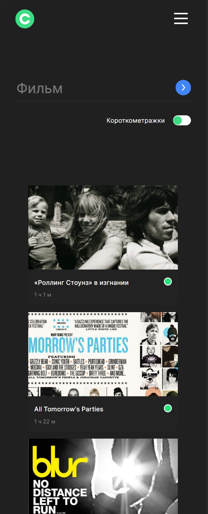

# movies-explorer-frontend  

# Проект Movies (фронтенд)

макет https://www.figma.com/file/6FMWkB94wE7KTkcCgUXtnC/light-1?type=design&node-id=1-11614&mode=design&t=T7myGf3jg4xzqY2o-0  

**В проекте реализованы возможности:**

* Регистрация / авторизация пользователя
* Изменение информации о себе
* Поиск фильмов по ключевым словам с возможностью фильтрации по продолжительности
* Добавление / удаление фильма из сохраненных

## Запуск проекта  

`npm i` — установить все зависимости   
`npm run start` — запускает сервер   
`npm run build` — запуск проекта в режиме продакшн, с формированием файлов подготовленных к деплою в директории /build 

**Desktop**
  

 

 

**Mobile**

 

 

 

Адрес репозитория https://github.com/ApostalDante/movies-explorer-frontend  

Pull request https://github.com/ApostalDante/movies-explorer-frontend/pull/2  

Приложение https://movies.dante.nomoredomainsrocks.ru  

